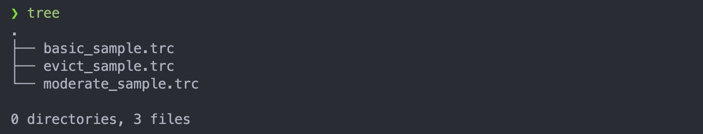

# cache-simulator

Computer Architecture - Final Cache-Simulator Assignment


This is a computer-architecture assignment implements a set associative cache simulator written in <code>C, Shell Script</code>. A set associative cache simulator Write policy is write-back and it follows LRU replacement strategy

### How to execute <code>test.sh</code>

---

1. check help manual

```
    $ ./{relative_path}/test.sh -h
    or
    $ (bash | sh) ${relative_path}/test.sh -h
    USAGE:
    test.sh [-s=<val>] [-b=<val>] [-a=<val>] [-d=<val>]
        [-h]

    DESCRIPTIONS:
    -s=<val>, s( cache_size ): total size of cache
    -b=<val>, b( block_size ): size of block
    -a=<val>, a( associative_size ): cache assocative size
    -d=<val>, d( dir_name ): tracefile set directory name
    -h, print usage
```

2. Simulate the tracefile

```
    $ ./{relative_path}/test.sh -s {cache_size} -b {block_size} -a {associative_size} -d {tracefile_directory}
```

- tracefile_directory
  
  it must include varity type of trace file to simulate

  <code>tracefile example</code>

  ```
    $ find . -name "*"  -exec cat {} /dev/null \;

    // basic_sample.trc
    00010000 W 1
    00010004 W 2
    00010008 W 3
    0001000C W 4
    00010000 R
    00010004 R
    00010008 R
    0001000C R
    00110004 W 134
    00110000 W 135
    00111000 W 136
    00010004 R
    00010000 W 12
    00010004 W 15
    10010000 W 13

    // evict_sample.trc
    00010000 W 1
    00010004 W 2
    00010000 R
    00010008 W 3
    0001000C W 4
    00010010 W 5
    00010100 W 6
    00010104 W 7
    00010120 W 8
    00010160 R
    00010000 R
    00010004 R
    00010004 R
    00010008 R
    0001000C R
    00010248 R

    // moderate_sample.trc
    00010000 W 1
    00010004 W 2
    00010008 W 3
    0001000C W 4
    00010000 R
    00010004 R
    00010008 R
    0001000C R
  ```

  ***

  <code>tracefile execution example</code>

  ```

  $ ./test.sh -s 64 -b 8 -a 2 -d tracefile

  // result simulate
  cache_size: 64
  block_size: 8
  associative_size: 2

  ----------------< simulation start >------------------

  Running test ( basic_sample.trc )
  0: 0000000D 00000000 v: 1 d: 1
  0000000C 0000000F v: 1 d: 1
  1: 00000003 00000004 v: 1 d: 1
  00000000 00000000 v: 0 d: 0
  2: 00000000 00000000 v: 0 d: 0
  00000000 00000000 v: 0 d: 0
  3: 00000000 00000000 v: 0 d: 0
  00000000 00000000 v: 0 d: 0

  total number of hits: 10
  total number of misses: 6
  miss rate: 37.5%
  total number of dirty blocks: 3
  average memory access cycle: 113.5

  ----------------------------------------

  Running test ( evict_sample.trc )
  0: 00000001 00000002 v: 1 d: 0
  00000000 00000000 v: 1 d: 0
  1: 00000003 00000004 v: 1 d: 1
  00000000 00000000 v: 1 d: 0
  2: 00000005 00000000 v: 1 d: 1
  00000000 00000000 v: 0 d: 0
  3: 00000000 00000000 v: 0 d: 0
  00000000 00000000 v: 0 d: 0

  total number of hits: 8
  total number of misses: 8
  miss rate: 50.0%
  total number of dirty blocks: 2
  average memory access cycle: 138.5

  ----------------------------------------

  Running test ( moderate_sample.trc )
  0: 00000001 00000002 v: 1 d: 1
  00000000 00000000 v: 0 d: 0
  1: 00000003 00000004 v: 1 d: 1
  00000000 00000000 v: 0 d: 0
  2: 00000000 00000000 v: 0 d: 0
  00000000 00000000 v: 0 d: 0
  3: 00000000 00000000 v: 0 d: 0
  00000000 00000000 v: 0 d: 0

  total number of hits: 6
  total number of misses: 2
  miss rate: 25.0%
  total number of dirty blocks: 2
  average memory access cycle: 51.0

  ----------------------------------------

  Running test ( sample.trc )
  0: 00000001 00000002 v: 1 d: 1
  00000000 00000000 v: 0 d: 0
  1: 00000003 00000004 v: 1 d: 1
  00000000 00000000 v: 0 d: 0
  2: 00000000 00000000 v: 0 d: 0
  00000000 00000000 v: 0 d: 0
  3: 00000000 00000000 v: 0 d: 0
  00000000 00000000 v: 0 d: 0

  total number of hits: 6
  total number of misses: 2
  miss rate: 25.0%
  total number of dirty blocks: 2
  average memory access cycle: 51.0

  ----------------------------------------
  ```

---

### Roles

<code>hyunseo Lee (이현서 2021113490)</code>

- Algorithmic design
- Create Initial Code
- Coding the test case simulator

<code>Chanho Kim (김찬호 2021114818)</code>

- Algorithm improvement
- Code correction
- Bug Detection and Fixation
